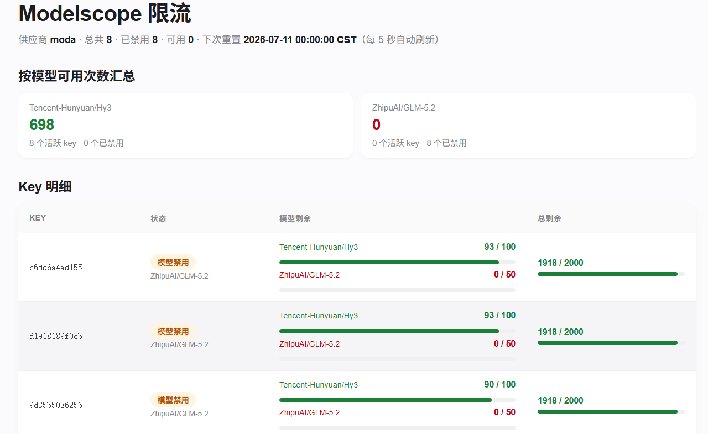

<div align="center">

# 🛡️ modelscope-ratelimit

**CLIProxyAPI 的 Modelscope 限流插件**

限额账号智能禁用 · 分组凭据智能选择 · 指数退避避流重试


</div>

---

## 📖 背景

Modelscope 免费额度是**共享配额**——多个 key、多个托管 provider 共用同一天配额。解决：

- 🔴 **429 频繁** — 高并发下无上游限流感知，请求 → 429 → 重试 → 再 429，恶性循环
- 🔴 **限额账号不管控** — 跑满额度的 key 仍被反复选中，死锁报错、浪费请求次数

---

## ✨ 后台显示数据



---

## ✨ 核心特性

**1. 限额账号智能禁用** — 实时监控响应，额度耗尽即禁用该凭据，后续请求精准分发至健康账号。单模型耗尽只禁该模型，总额度耗尽全局禁用。00:00 自动恢复。

**2. 分组凭据智能选择** — 按 provider 分组，内置 `round-robin`（轮询）/ `fill-first`（填充优先）策略，按 api-key 填入顺序轮换。`providers` 顺序即优先级。

**3. 指数退避避流重试** — 连续 429 时全局阻塞，退避 ×2 递增（`10→20→40→60s` 封顶），叠加随机抖动防 thundering-herd，成功响应自动重置。

**4. 状态页** — 后台实时展示掩码 key、模型剩余进度条、可用计数，5s 自动刷新。

---

## 🚀 快速开始

### 方式一：使用已构建版本

从 [Releases](https://github.com/bytehola/modelscope-ratelimit/releases) 下载对应平台的预编译产物，放入 CLIProxyAPI 的 `plugins/<os>/<arch>/` 目录。

**Linux (amd64)**

```bash
mkdir -p plugins/linux/amd64
cp modelscope-ratelimit.so plugins/linux/amd64/
```

**Windows (amd64)**

```powershell
mkdir plugins\windows\amd64
copy modelscope-ratelimit.dll plugins\windows\amd64\
```

### 方式二：从源码构建

**环境**：Go 1.26+ · [zig](https://ziglang.org/) 0.13+（交叉编译 Windows）· CLIProxyAPI v7.2.51+

```bash
git clone https://github.com/bytehola/modelscope-ratelimit.git
cd modelscope-ratelimit

bash build.sh           # 编译 .so（Linux）
bash build.sh windows   # 交叉编译 .dll（Windows）
bash build.sh test      # 单元测试（-race）
```

### 配置

在 CLIProxyAPI 的 `config.yaml` 中配置：

```yaml
plugins:
  enabled: true
  dir: "plugins"
  configs:
    modelscope-ratelimit:
      enabled: true
      priority: 10
      providers: ["modelscope"]              # 监控的供应商名称，必填，顺序=优先级
      host_base_url: "http://127.0.0.1:8317" # CPA 管理 API 地址（选填）
      management_key: "your-secret"          # CPA 管理密钥（必填）
      credential_strategy: "round-robin"    # round-robin | fill-first
      insufficient_quota_cooldown: 10         # 退避基准秒数，封顶 60s
```

> 完整配置见 [`config.example.yaml`](./config.example.yaml)

---

## 🛠️ 工作原理

```text
请求 → scheduler.pick（跳过禁用 key/model，按优先级选健康凭据）
     → 上游请求
     → response/stream 拦截
        ├─ 有限流头 → 解析剩余次数，耗尽则禁用
        └─ 429 insufficient_quota → 全局阻塞退避（×2 递增，封顶 60s）
     → 00:00 自动重置禁用状态
```

- **优先级**：`providers` 顺序即优先级，前组额度耗尽后才用后续组
- **作用域**：单模型耗尽只禁该模型，总额度耗尽全局禁用，非托管 provider 不受影响
- **退避**：同 provider 共享配额，冷却无关 key，全局递增避免二次限流

---

## 📦 项目结构

```text
modelscope-ratelimit/
├── cmd/plugin/main.go              # C-ABI 胶水：方法分发、管理API、状态页
├── internal/ratelimit/
│   ├── apply.go                    # 限流头解析 + 冷却钩子
│   ├── config.go                   # 配置 + ManagesProvider
│   ├── scheduler.go                # 全局阻塞 + 优先级调度
│   ├── state.go                    # 并发状态：禁用/冷却/退避/快照
│   ├── status_html.go              # 状态页 HTML
│   └── types.go                    # JSON 线格式
├── build.sh                        # 编译脚本
├── config.example.yaml             # 配置示例
└── README.md
```

---


## 📄 许可证

[MIT](LICENSE)

## 来自 Linux Do

[LINUX DO 社区](https://linux.do/u/k452b)
